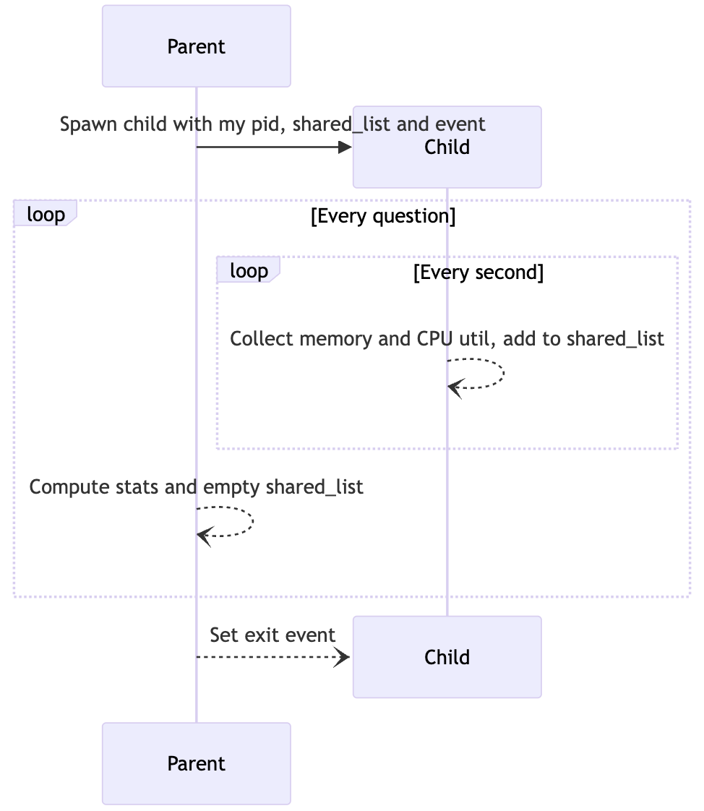

Multithreaded Test Framework for Comparing Local LLM Performance for Document Q&A

**Step-by-step guide on TowardsDataScience**: 
___
## Context
Even through there are third-party commercial large language model (LLM) providers like OpenAI's GPT4 have made it easy to access LLM use via simple API calls, privacy-conscious researchers and engineers are looking to deploy a fully local model to allow querying against their local documents. The proliferation of open-source LLMs is providing us with many options, which may be daunting.
In this project, we will introduce  a multithreaded test regime to more objectively query and compare the disparate models to find the best LLM for our constraints.
  

___
## How to Install
- Create and activate the environment:
`$ python3.10 -m venv mychat
$ source mychat/bin/activate`
- Install libraries:
`$ pip -r requirements`
- Download models to the model directory:
`$` 
___
## Quickstart
- Ensure you have downloaded the GGML binary file from https://huggingface.co/TheBloke/Llama-2-7B-Chat-GGML and placed it into the `models/` folder
- To start parsing user queries into the application, launch the terminal from the project directory and run the following command:
`poetry run python main.py "<user query>"`
- For example, `poetry run python main.py "What is the minimum guarantee payable by Adidas?"`
 

___
## Tools
- **LangChain**: Framework for developing applications powered by language models
- **FAISS**: Open-source library for efficient similarity search and clustering of dense vectors.
- **Sentence-Transformers (all-MiniLM-L6-v2)**: Open-source pre-trained transformer model for embedding text to a 384-dimensional dense vector space for tasks like cosine similarity calculation.

___
## Files and Content
- `models`: Directory hosting sub-directories of downloaded LLMs
- `opdf_index`: FAISS vector store for documents
- `pdf_qa.py`: Main Python script to launch the application and to pass user query via command line
- `LoadVectorize.py`: Python script to load a pdf document, split and vectorize
- `LLMPerfMonitor.py`: Python script to calculate metrics and load a list of question
- `requirements.txt`: List of Python dependencies (and version)
___

## References
- https://huggingface.co/TheBloke/Llama-2-7B-Chat-GGML
